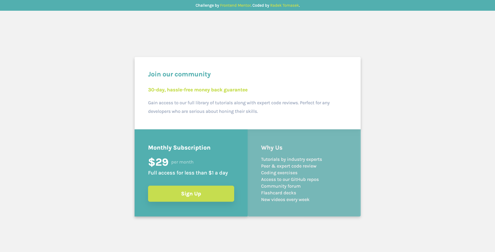

# Single price grid component

This repository contains an implementation of one of the Frontend Mentor Challenges - [Single price grid component](https://www.frontendmentor.io/challenges/single-price-grid-component-5ce41129d0ff452fec5abbbc) using HTML/CSS ([TailwindCSS](https://tailwindcss.com)).

## Overview

This is my second [Frontend Mentor](https://www.frontendmentor.io) Challenge and it was definitely a big fun to implemement it. As with the [previous one](https://github.com/radektomasek/fm-huddle-page-single-section), I decided to use [TailwindCSS](https://tailwindcss.com) for the styling part.

The process was very straigtforward. In terms of complexity, I feel, the implementation was less challenging than the [Huddle Page Single Section](https://github.com/radektomasek/fm-huddle-page-single-section) one, but it was a great opportunity to practise Grid layout on a deeper level.

### Screenshots

#### Mobile Version

The page was built with mobile first approach in mind. And tested in various dimensions emulating different mobile screens (small resolutions).

#### Tablet Version

As no tablet breakpoints were specified, I assumed the expected behaviour would be to maintain the mobile sized container for the content until it reaches the desktop breakpoints. Which is the approach you can see in the second screenshot.

#### Desktop Version

Desktop version is the largest one. It was a good exercise to practise the Grid options and aim the layout to be as close to the original as possible.

It probabably doesn't match the exact design, but I am personally really happy with the final look and feel.

### Links

- Solution URL: [https://github.com/radektomasek/fm-single-price-grid-component](https://github.com/radektomasek/fm-single-price-grid-component)
- Live Site URL: [https://radektomasek.github.io/single-price-grid-component](https://radektomasek.github.io/single-price-grid-component)

### Built with

- Semantic HTML5 markup
- CSS Grid
- Mobile-first workflow
- [Parcel](https://parceljs.org) - a simple, zero config builder
- [TailwindCSS](https://tailwindcss.com) - TailwindCSS for styles

### What I learned

The requirements were pretty straighforward, so I was able to implement most of the stuff relatively comfortably (I wrote everything in [TailwindCSS](https://tailwindcss.com) without a warm up coding using [SASS (SCSS)](https://sass-lang.com/)).

The biggest learning for me was to figure out how Tailwind works with Grid properties to make some specific tweaks. I am relatively comfortable with the standard CSS, but I wanted to to figure out how to utilize the utility classes of Tailwind without rewriting to much in the config file.

And I belive, I was quite successful and I really like the output.

### Continued development

Despite the fact I am not an expert in Tailwind, I still believe it makes a sense to avoid cluttering of the main template by writing utility classes straight in the HTML file. I rather definine plain class names in the HTML file and write the styles in an external CSS file (by using utility classes whenever it makes a sense).

The learning for me is to fugure out what is the best methodology. I am familiar to BEM and tried to use it in this project. I use this approach when I write styles using [SASS (SCSS)](https://sass-lang.com/), but I wonder whether it makes a sense to follow BEM principles whilst using [TailwindCSS](https://tailwindcss.com)?

Another learning thing for me is to find a balance between the implemention of a Pixel perfect design vs comfort using pre-defined utility classes in TailwindCSS without making overrides. I think I managed to get that balance, but there is definitely still a lot to learn.

### Useful resources

- [Tailwind CSS From Scratch](https://www.udemy.com/course/tailwind-from-scratch) - I would still recommend this Udemy course for anyone who is interested in learning TailwindCSS. I followed it more than 1 year ago, and it helped me to understand some good practises when it comes to Tailwind.

## Author

- Frontend Mentor - [@radektomasek](https://www.frontendmentor.io/profile/radektomasek)
- Linkedin - [radektomasek](https://www.linkedin.com/in/radektomasek)
- Twitter - [@radek_tomasek](https://twitter.com/radek_tomasek)
